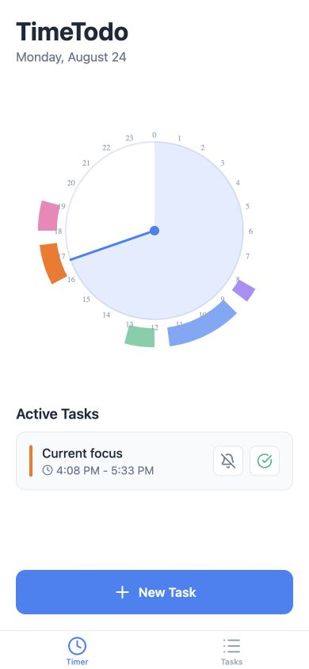

# TimeTodo Supabase Prototype

An Expo Router prototype of TimeTodo with a radial 24-hour clock, active-task actions, task editing, repeat schedules, and optional Supabase persistence.



## Run it

Install dependencies:

```bash
npm install
```

Start the web app with curated local demo tasks:

```bash
npm run web
```

Demo mode is in-memory only. Snoozing, completing, adding, editing, pausing, or deleting a demo task does not write to Supabase and resets when the app reloads.

To use the configured Supabase backend instead, create an `.env` file containing:

```dotenv
EXPO_PUBLIC_SUPABASE_URL=your-project-url
EXPO_PUBLIC_SUPABASE_ANON_KEY=your-anon-key
```

Then run:

```bash
npm run dev
```

If the backend is unavailable or contains no tasks, the app falls back to the local demo schedule.

## Useful commands

```bash
npm run typecheck
npm run build:web
```

## Stack

- React Native 0.81 and React 19
- Expo SDK 54 and Expo Router
- TypeScript
- Supabase
- React Native SVG
- Lucide React Native

## Implemented

- Timer screen with a radial clock and colored task arcs
- Live active-task detection, snooze, and completion actions
- Task manager with date navigation, editing, deletion, pause, and repeat rules
- New-task modal with radial time selection
- Local demo mode plus Supabase-backed persistence
