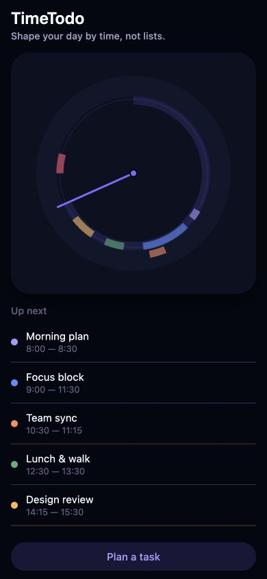

# TimeToDo — React Native UI Prototype

An Expo 54 and React Native prototype focused on the polar-clock interface and visual design of TimeToDo.



## Run

```bash
npm install
npm start
```

Scan the QR code with Expo Go, or run the web version with:

```bash
npm run web
```

On first launch, the app seeds a small demo schedule when no saved tasks exist.
